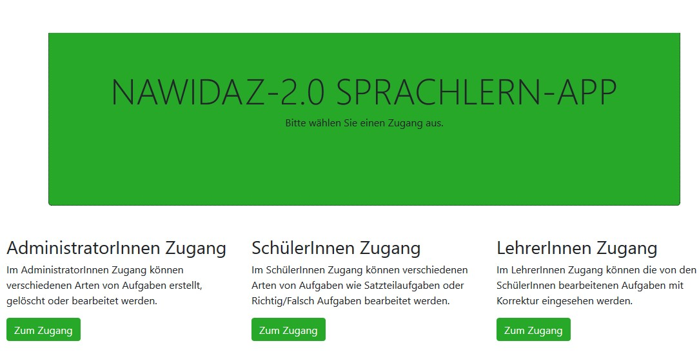
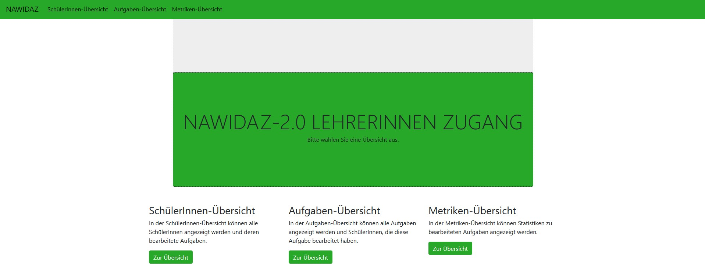
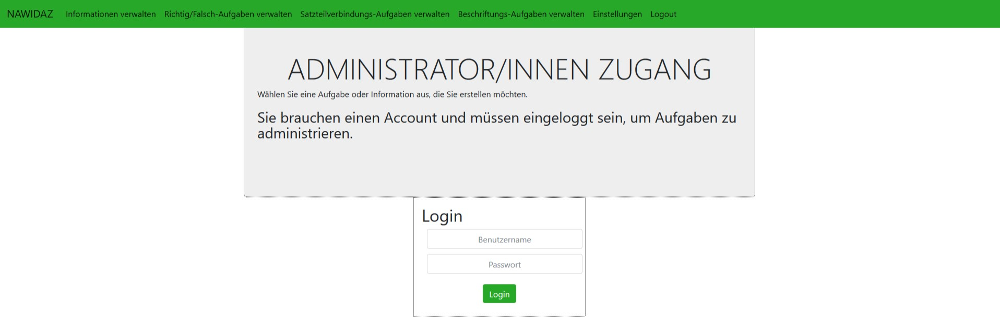
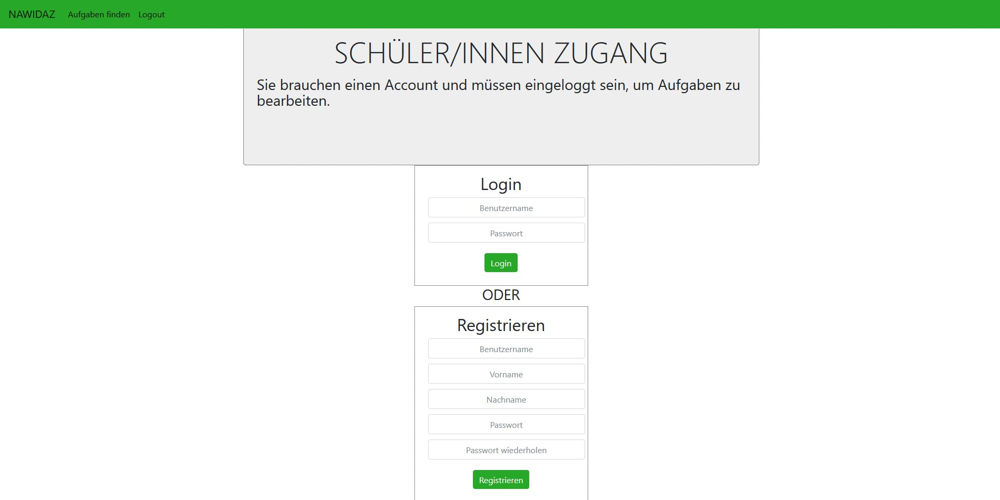

# quizapp

## Motivation

Mobilgeräte wie Smartphones und Tablets sind aus unserem Alltag kaum mehr wegzudenken und ermöglichen es,
Anwendungssoftware (Apps) überall einzusetzen. In Schulen haben Schüler oft das Problem das die 
Lehreinheiten nicht interaktiv genug sind und die Bewertung von einem Lehrer durchgeführt werden muss.

Das heiEDUCATION Projekt ist ein gemeinsames Projekt der Universität Heidelberg und der Pädagogischen Hochschule Heidelberg. 
Im Rahmen dieses Projekts soll das Erlernen von Sprache im naturwissenschaftlichen Kontext untersucht werden. 
Dafür eine Android App entwickelt, die es ermöglicht naturwissenschaftliche Fachsprache ohne Verwendung der Muttersprache des Lernenden zu vermitteln.
Die App kann im Unterricht eingesetzt werden ohne das eine Verbindung in das Internet von Nöten ist. Die App ist lauffähig auf einen Raspberry Pi und 
von dort aus dann erreichbar auf den Lokalen Geräten. Hiermit kann man eine Sichere Lernumgebung für Schüler sichern. 

## Beschreibung der Entwicklung

Bei der Entwicklung der App werden Methoden kontinuierlicher Softwareentwicklung eingesetzt. Zur Sicherung der Qualität wurde das Testsystem in der 
kontinuierlichen Softwareentwicklung eingebunden so das nach jeder Version in der Versionsverwaltung (Git) Regressionstest durchlaufen wurden. Test der 
Erreichbarkeit und Nutzbarkeit wurden mit Hilfe von Selenium und Selenium Grid durchgeführt. Komponenten Test wurden mit Hilfe von JUnit Test durchgeführt.

# Benutzerbeschreibung
## Installationsbeschreibung
## Lehrer nutzung

## Administrator nutzung

## Studenten nutzung
