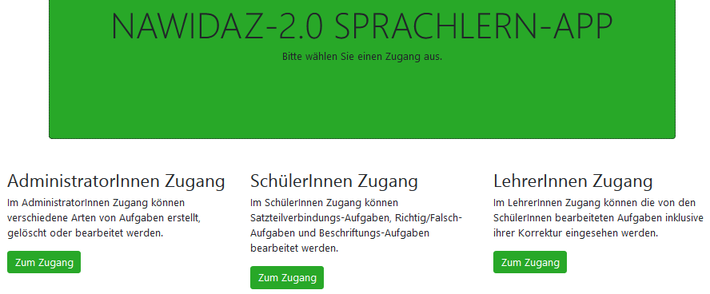

# NaWiDaZ Quiz App

This repository contains the code of a mobile quiz web app that was developed within the [NaWi-DaZ 2.0 project](http://se.ifi.uni-heidelberg.de/research/projects/nawi_daz_20.html).
It is written in Java and web programming languages (e.g., Java Server Pages, Java Script) and stores data in an [SQLite database](https://www.sqlite.org).
The app runs on a Java servlet container such as [Tomcat](https://tomcat.apache.org/) or [Jetty](https://www.eclipse.org/jetty/) and can be accessed via browser.

The app has been developed in order to teach students the German language with a focus on natural sciences and the scientific terminology. 
The app distinguishes between three user roles: administrators, students and teachers.
Currently, there are three differnt types of exercises: multiple choice exercises, sentence part exercises, and exercises to label images.

 

## NaWi-DaZ 2.0 Project

[NaWi-DaZ 2.0](http://se.ifi.uni-heidelberg.de/research/projects/nawi_daz_20.html) was a joint project between the Heidelberg School of Education and the Software Engineering group of the Heidelberg University. 
It was financially supported by the [PLACE programme](https://hse-heidelberg.de/forschung/place-aktuell/).
The NaWi-DaZ 2.0 project investigated how students can learn the German language with a focus on natural sciences.
For this purpose, this mobile quiz web app was developed, which enables students to learn scientific terminology without using their first language.

## Installation

### Prerequisites
The following prerequisites are necessary to install the app:

- Java 8 JDK or OpenJDK
- Java servlet container such as [Tomcat](https://tomcat.apache.org/) or [Jetty](https://www.eclipse.org/jetty/)

### Run the App on a Raspberry Pi

An advantage of this app is that it can be used in school classes without requiring access to the internet.
The app can be installed on a [Raspberry Pi](https://www.raspberrypi.org/). This Raspberry Pi needs to be connected to a WLAN router that sets up a wireless local area network (WLAN).
Then, students and the teacher can login to the local WLAN via their smartphones or tablets (or laptops) and they can access the app in their browser.

This has the following benefits:
- The app can be used everywhere (where this infrastructure is set up). That is, it can also be run in schools without access to the internet.
- The data remains confidential.

## Unit and Selenium Tests

The quality of the app is ensured using JUnit and Selenium tests.

# Usage Description

## Administrator

The administrator is allowed to administer the app. 
First, the administrator needs to login.

 

Then, s/he can manage (create, update and delete) instances of three differnt types of exercises (multiple choice exercises, sentence part exercises and exercises to label images).
In addition, the administrator can manage information material that is related to exercises. 

 

The administrator has also access to a settings page that e.g. enables him/her to backup or to reset the database.

## Student
Students need to be registered, in order to login to the students' page.
They have the possibility to learn from information material and solve related exercises.
After solving an exercise, students instantly receive feedback.

 

## Teacher
Teachers can get an overview about the students' exercise results on the teacher page.
They can either see every result of a certain exercise or all results by a certain student.
In addition, teachers have the possibility to access a statistics overview that visualizes the number of correctly and incorrectly solved exercises using barplots.